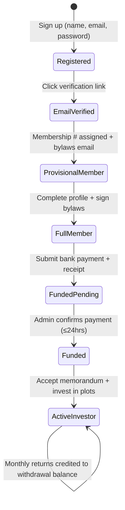
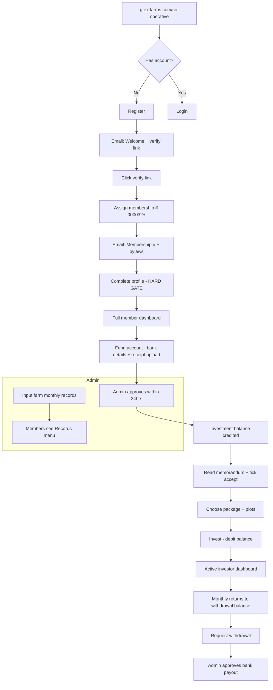

# GText Farms Co-operative — Detailed Product Flow Plan

This document maps the client requirements (WhatsApp brief, legal documents, and dashboard references) onto a buildable system. It is grounded in what the app already has and what must be added.

**Last updated:** June 2026  
**Entry URL:** `gtextfarms.com/co-operative`

---

## 1. Product vision

**GText Farms Co-operative Society** is a membership-gated poultry investment programme:

1. Join the co-operative (register → verify email → get membership number)
2. Complete full member profile (hard gate)
3. Fund account via **manual bank transfer** (receipt upload → admin confirms within 24hrs)
4. Accept legal documents (memorandum / investment agreement)
5. Invest in **packages/plots**
6. Track **investment balance** and **withdrawable returns** on a farm-style dashboard
7. Admins record farm operations (monthly summary style) from the backend

The public entry point: **`gtextfarms.com/co-operative`** (register / login).

---

## 2. Member lifecycle (status machine)

Every user progresses through explicit states. Nothing beyond registration works until the previous step is complete.



| Status | Can access | Blocked from |
|--------|------------|--------------|
| `registered` | Verify-email page only | Everything else |
| `email_verified` | Awaiting membership email | Dashboard, profile, payments |
| `provisional_member` | Profile completion form | Investments, payments |
| `full_member` | Payment page, legal docs | Investing until funded |
| `payment_pending` | Payment status screen | Investing |
| `funded` | Browse packages, accept memorandum | Investing until memorandum signed |
| `active_investor` | Full dashboard, invest, withdraw | — |

**Hard gate rule:** Middleware on `/co-operative/app/*` redirects to the next required step if status is incomplete.

---

## 3. End-to-end user journey

### Phase A — Co-operative portal (`/co-operative`)

**URL structure (proposed):**

| Route | Purpose |
|-------|---------|
| `/co-operative` | Landing: Welcome + Register / Login |
| `/co-operative/register` | New member registration |
| `/co-operative/login` | Returning member login |
| `/co-operative/verify-email` | “Check your inbox” + resend |
| `/co-operative/complete-profile` | Full membership form (blocked until here) |
| `/co-operative/dashboard` | Member dashboard (after full member) |
| `/co-operative/fund` | Bank details + payment submission |
| `/co-operative/invest` | Packages / plots |
| `/co-operative/records` | Farm performance (read-only for members) |
| `/co-operative/withdraw` | Monthly withdrawal requests |

> **Note:** Today auth lives at `/auth/*` and investor app at `/app/*`. Co-operative can be a **branded sub-portal** that reuses the same backend but different routes, copy, and gates — or eventually replace `/app` for co-op members.

---

### Phase B — Registration (Step 1)

**Form fields:**

- First name
- Last name
- Email
- Password
- Repeat password

**On submit:**

1. Create user with `membershipStatus: "registered"`, `role: "investor"`, `cooperativeMember: true`
2. Send **Email 1 — Welcome & verify**
   - Subject: *Welcome to GText Farms Co-operative Society*
   - Body: welcome message, link to verify email, note that bylaws will follow after verification
3. Redirect to `/co-operative/verify-email`

**Email 1 does NOT include membership number yet.**

---

### Phase C — Email verification (Step 2)

**On link click:**

1. Mark `emailVerified: true`, `membershipStatus: "email_verified"`
2. Auto-assign **membership number** (sequential, zero-padded):
   - Start: `000032` (configurable `COOP_MEMBERSHIP_START=32`)
   - Format: `000032`, `000033`, … `000999`, etc.
   - Store in `User.membershipNumber` (unique index)
3. Send **Email 2 — Membership confirmed**
   - Membership number
   - PDF/link to **bylaws** (attach or link to `/legal/cooperative-bylaws`)
   - Link to complete profile
4. Update status → `provisional_member`
5. Redirect → `/co-operative/complete-profile`

**Nothing else is clickable** until profile is complete (middleware enforces this).

---

### Phase D — Complete profile (Step 3) — becomes Full Member

Multi-section form matching the **Subscription Form** client provided:

#### Personal information

- Full name (pre-filled from registration)
- Date of birth
- Gender
- Nationality

#### Contact information

- Phone number
- Email (read-only)

#### Identification details

- ID type (NIN / Passport / Voter card / Driver’s licence)
- ID number
- Upload: ID document (front/back)
- Upload: passport photograph(s)

#### Next of kin

- Full name
- Relationship
- Address
- Phone number

#### Membership information (mostly system-filled)

- Membership number (read-only, assigned)
- Date of application (auto)
- Date of admission (set when admin approves profile, or auto on submit)
- **Signature / checkbox:** “I agree to abide by the cooperative bylaws and regulations”

#### Financial information

- Bank details for payouts (account name, bank, account number)
- Optional: occupation, employer (from subscription form)

**On submit:**

1. Save all fields + file URLs (needs file storage: Supabase Storage / S3 / Cloudinary)
2. `membershipStatus: "full_member"`, `profileCompletedAt: Date`
3. Optional: admin review queue (if manual admission required)
4. Redirect → `/co-operative/dashboard` with prompt: *Fund your account to start investing*

**Gate:** All routes except profile, logout, and legal docs are blocked until `full_member`.

---

### Phase E — Funding via manual bank transfer (Step 4)

**Trigger:** Member clicks “Fund account” / “Make payment”.

**Screen shows:**

1. **Company bank details** (admin-configurable):
   - Account name
   - Bank name
   - Account number
   - Reference format: `GF-{membershipNumber}`

2. **Payment submission form:**
   - Name on account (payer)
   - Bank name
   - Amount paid (₦)
   - Upload payment receipt (image/PDF)
   - Optional: transfer date, reference

3. **Notice:** *Payment confirmation can take up to 24 hours.*

**On submit:**

1. Create `DepositRequest` record: `status: "pending"`
2. Amount shows in dashboard as **“Pending approval”** (not yet investable)
3. Notify admin (email / admin queue)
4. Member sees status: *Awaiting confirmation*

**On admin approval:**

1. Credit **investment balance** (wallet bucket)
2. `DepositRequest.status: "approved"`
3. Email member: *Payment confirmed — ₦X available for investment*
4. Member can now proceed to invest

> **Current gap:** App uses Paystack auto-credit only. This flow is **net-new**.

---

### Phase F — Legal acceptance before investing (Step 5)

Before first investment, member must read and accept:

| Document | Source |
|----------|--------|
| Poultry Investment Agreement | Client WhatsApp doc |
| Subscription Form | Acknowledged at profile step |
| Land Security Undertaking | Client WhatsApp doc |
| Memorandum / bylaws | Already sent at verification |

**UI flow:**

1. `/co-operative/invest` → list available packages
2. Click package → modal/page with memorandum + agreement text
3. Checkboxes:
   - ☐ I have read the Memorandum
   - ☐ I accept the Poultry Investment Agreement
   - ☐ I acknowledge the Land Security Undertaking
4. “Proceed to invest” enabled only when all ticked
5. Store `InvestmentConsent` record with timestamp + IP + document versions

> **Current:** `/legal/investment-agreement` exists as marketing copy — needs co-operative-specific versions.

---

### Phase G — Invest in packages / plots (Step 6)

**After payment confirmed + legal accepted:**

1. Member sees available **investment packages** (admin-defined):
   - Example: Layer Poultry — ₦500,000 per plot
   - Min/max plots per member
   - Cycle duration, expected returns

2. Click **Invest** → enter **number of plots**
   - Total = plots × price per plot
   - Must be ≤ available investment balance

3. Confirm → debit investment balance → create `Investment` with:
   - `plots` count
   - `certificateNumber`
   - Link to cycle/package
   - Generate downloadable **Investment Certificate** (references Agreement)

> **Current gap:** Investing is per-cycle custom amount, not plot-based packages.

---

## 4. Member dashboard design

Inspired by farm management dashboard references (monthly summary Excel + farmkart-style UI).

### Top KPI cards

| Card | Source | Behaviour |
|------|--------|-----------|
| **Available balance for investment** | Wallet `investmentBalance` | Increases when admin approves deposits; decreases on invest |
| **Available funds for withdrawal** | Wallet `withdrawableBalance` | Monthly returns credited here; member can request withdrawal |
| **Pending payment** | Sum of `pending` deposits | “Awaiting confirmation (up to 24hrs)” |
| **Active investments** | Count + total plots | Links to portfolio |
| **Total invested** | Sum of confirmed investments | — |

### Secondary sections

- **Investment portfolio** — plots, cycle, status, certificate link
- **Payment history** — deposits (pending/approved/rejected)
- **Withdrawal history** — monthly withdrawal requests
- **Farm records** — read-only view of admin-entered monthly data (eggs, birds, feed, revenue)
- **Documents** — bylaws, agreement, certificate downloads

### Records menu (member view)

Read-only charts/tables from admin data:

- Egg production vs forecast
- Bird stock (layers, chicks, mortality)
- Feed consumption by type
- Revenue / expenditure summary

---

## 5. Admin flows

### 5.1 Membership management (`/admin/cooperative/members`)

| Action | When |
|--------|------|
| View all members | Filter by status |
| Approve profile (optional) | If manual admission required |
| View membership #, documents | KYC-style review |
| Reject / request corrections | With reason email |

Reuses pattern from `/admin/investors` KYC queue.

---

### 5.2 Payment confirmation (`/admin/cooperative/deposits`)

Queue similar to withdrawals:

| Column | Data |
|--------|------|
| Member | Name + membership # |
| Amount | ₦ |
| Bank / payer name | From form |
| Receipt | View uploaded image |
| Submitted | Date/time |
| Status | pending / approved / rejected |
| Actions | Approve → credit balance / Reject with note |

**SLA indicator:** highlight if pending > 24hrs.

---

### 5.3 Farm records (`/admin/cooperative/records`)

Admin inputs operational data (monthly summary Excel style).

**Per farm / per month:**

| Category | Fields |
|----------|--------|
| **Stock** | Hens, roosters, chicks, mortality, opening/closing stock |
| **Production** | Eggs produced, broken eggs, feed intake (kg), trays |
| **Sales** | Egg sales (₦ + qty), meat sales, bird sales, other revenue |
| **Expenses** | Feeds, vet, rent, maintenance, marketing, etc. |
| **Targets** | Egg laying ratio, broken egg ratio, FCR, mortality rate |
| **Meta** | Month, year, farm manager name |

**Outputs:**

- Investor-facing `/co-operative/records` charts
- Optional: auto-calculate investor returns from net profit (future phase)

---

### 5.4 Packages & cycles (`/admin/cooperative/packages`)

- Create investment packages (name, price per plot, total plots, cycle link)
- Open/close funding
- View plot allocation per member

---

### 5.5 Withdrawals (`/admin/withdrawals` — extend)

- Member requests from **withdrawable balance** only
- Admin approves → manual bank transfer (existing pattern)
- Monthly window optional (e.g. 1st–5th of month)

---

## 6. Email sequence summary

| # | Trigger | Content |
|---|---------|---------|
| 1 | Registration | Welcome + verify link |
| 2 | Email verified | Membership # + bylaws |
| 3 | Profile completed | “You are now a full member” |
| 4 | Deposit submitted | “We received your payment — up to 24hrs” |
| 5 | Deposit approved | Amount credited + link to invest |
| 6 | Deposit rejected | Reason + resubmit link |
| 7 | Investment confirmed | Certificate + agreement summary |
| 8 | Monthly return credited | Amount added to withdrawal balance |
| 9 | Withdrawal approved/rejected | Status update |

Uses **Resend** for transactional mail.

---

## 7. Data model changes (new / extended)

### Extend `User`

```
membershipNumber: string (unique)
membershipStatus: enum (see state machine)
emailVerified: boolean
emailVerificationToken, expires
cooperativeMember: boolean
profileCompletedAt: Date
dateOfBirth, gender, nationality
idType, idNumber, idDocumentUrls[], passportPhotoUrls[]
nextOfKin: { name, relationship, address, phone }
bylawsAcceptedAt: Date
occupation, employer
admissionDate: Date
```

### New `CoopSettings` (singleton)

```
membershipCounter: number (starts 32)
bankAccountName, bankName, bankAccountNumber
paymentConfirmationHours: 24
```

### New `DepositRequest`

```
userId, membershipNumber
payerAccountName, payerBankName, amount
receiptUrl, transferReference, transferDate
status: pending | approved | rejected
reviewedBy, reviewedAt, rejectionReason
```

### Extend `Wallet`

```
investmentBalance: number   // for investing
withdrawableBalance: number // monthly returns
pendingDepositAmount: number // optional display helper
```

### New `InvestmentConsent`

```
userId, documentVersions[], acceptedAt, ipAddress
```

### New `CoopPackage`

```
name, slug, pricePerPlot, totalPlots, plotsSold
cycleId, status, memorandumVersion
```

### Extend `Investment`

```
packageId, plotCount, agreementAcceptedAt
```

### New `FarmMonthlyRecord`

```
farmId, month, year
stock: { hens, roosters, chicks, mortality, opening, closing }
production: { eggs, brokenEggs, feedKg, trays }
sales: { eggs, meat, birds, other }
expenses: { feeds, vet, rent, maintenance, ... }
targets: { layingRatio, brokenRatio, fcr, mortalityRate }
farmManager, notes
```

### New `MembershipCounter` or atomic sequence

For safe `000032` increment under concurrency.

---

## 8. What exists today vs what’s new

| Requirement | Current build | Work needed |
|-------------|---------------|-------------|
| `/co-operative` URL | ❌ `/auth/*` | New route group + branding |
| Register (name, email, password) | ✅ `/auth/sign-up` | Split first/last name; co-op copy |
| Email verification | ❌ | Token flow + emails |
| Membership # `000032+` | ❌ | Counter + assignment on verify |
| Profile completion gate | ⚠️ Soft KYC banner | Hard middleware + full form |
| Next of kin, ID uploads | ⚠️ BVN/NIN only | Expand KYC + file storage |
| Manual bank + receipt | ❌ Paystack only | DepositRequest + upload + admin queue |
| 24hr confirmation message | ❌ | UI copy + admin SLA |
| Invest after payment approved | ❌ Instant wallet | Gate on approved deposits |
| Plot-based packages | ❌ Custom amount | CoopPackage model |
| Memorandum tick-boxes | ❌ | InvestmentConsent flow |
| Investment balance vs withdrawal | ❌ Single balance | Split wallet buckets |
| Admin farm records | ⚠️ Field reports (weekly) | Monthly summary admin CRUD + charts |
| Legal documents | ⚠️ Generic agreement page | Co-op specific PDFs/pages |

---

## 9. Recommended implementation phases

### Phase 1 — Co-operative portal & membership (2–3 weeks)

- `/co-operative` routes + welcome copy
- Registration + email verification
- Membership number generator
- Profile completion form + hard gate
- Bylaws email + legal pages
- Admin member list

### Phase 2 — Manual payments (1–2 weeks)

- File upload storage
- Bank details config
- Deposit submission + admin approval queue
- Split wallet balances on dashboard
- Payment status emails

### Phase 3 — Investment & legal (1–2 weeks)

- Co-op packages / plots
- Memorandum + agreement acceptance
- Invest flow gated on funded + consented
- Certificate generation

### Phase 4 — Farm records dashboard (2 weeks)

- Admin monthly record entry (Excel-style form)
- Member records view with charts (farmkart + monthly summary style)
- Link records to farm/cycle performance

### Phase 5 — Withdrawals & returns (1 week)

- Monthly return crediting (admin or calculated)
- Withdrawal from withdrawable balance only
- Monthly withdrawal window (if required)

### Phase 6 — Polish & go-live

- Paystack as optional top-up (keep manual as primary if client prefers)
- SMS notifications (Termii)
- Demo seed data for client walkthrough
- Production env + document PDFs

---

## 10. Flow diagram (single page reference)



---

## 11. Legal documents (client-provided)

The following documents should be integrated into the platform:

1. **Poultry Investment Agreement** — between GText Farms Co-operative Society and Investor
2. **Poultry Investment Subscription Form** — personal, membership, next of kin, financial details
3. **Land Security Undertaking** — by GText Holdings Limited in favour of eligible investors

These should be available as:

- Downloadable PDFs (admin-uploaded)
- In-app legal pages with version tracking
- Checkbox acceptance before first investment (with timestamp stored)

---

## 12. Open decisions (confirm with client)

1. **Profile approval** — Auto “full member” on submit, or admin must approve admission?
2. **Paystack** — Keep as optional fast top-up, or manual bank only?
3. **Plot pricing** — Fixed packages (₦500k/plot) or flexible amounts within a cycle?
4. **Returns** — Admin manually credits monthly returns, or calculated from farm records?
5. **Withdrawal window** — Any day, or fixed monthly dates?
6. **File storage** — Supabase Storage, Cloudinary, or S3?
7. **Legal docs** — PDF upload by admin, or full HTML pages in app?

---

## 13. Environment variables (planned)

```env
# Co-operative membership
COOP_MEMBERSHIP_START=32
COOP_BYLAWS_URL=https://...

# Manual payment bank details (or admin UI)
COOP_BANK_ACCOUNT_NAME=
COOP_BANK_NAME=
COOP_BANK_ACCOUNT_NUMBER=

# File uploads
STORAGE_PROVIDER=supabase|s3|cloudinary
# ... provider-specific keys

# Email (existing)
RESEND_API_KEY=
APP_URL=
```

---

## 14. Suggested next step

Start with **Phase 1** (co-operative portal + membership flow) because everything else depends on membership status and the profile gate.

**Related docs:** `docs/IMPLEMENTATION_PLAN.md` (general platform build status)
